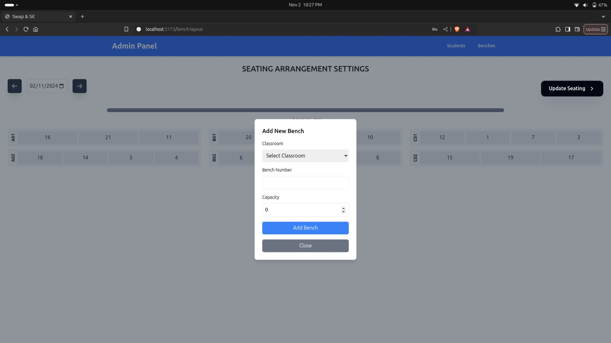

# Seat & Swap 🎯

## Basic Details
### Team Name: Trident

### Team Members
- Team Lead: Vishnu M - NSS College of Engineering , Palakkad
- Member 2: Advay P Kishore - NSS College of Engineering , Palakkad
- Member 3: Niyalurahman K K - NSS College of Engineering , Palakkad

### Project Description
Seat & Swap is designed to shake up the usual friend groups on campus! With a single click, students can swap seats and experience new conversations, meet new people, and strengthen campus connections

### The Problem (that doesn't exist)
Ever felt like everyone is sticking with the same crowd? It’s too easy to miss out on meeting new people, experiencing diverse perspectives, and appreciating the different cultures on campus.

### The Solution (that nobody asked for)
Seat Swap helps people break out of their comfort zones by facilitating random, fun seat swaps, leading to new friendships and stronger community bonds, all while promoting inclusivity and diversity in a lighthearted way.

## Technical Details
### Technologies/Components Used
For Software:
- TypeScript,Python
- django
- react

### Implementation
For Software:
# Installation
1. Clone the repository : 
    git clone git@github.com:Advay004/trident_useless_project.git
2. For Frontend 
    - cd 'Seat & Swap'/seating-frontend
    - npm install
3. For Backend
    - cd 'Seat & Swap'/seating-backend
    - python3 -m venv venv
    - source venv/bin/activate   # On Windows: venv\Scripts\activate
    - pip install -r requirements.txt

# Run
1. Start the frontend:
    npm run dev
2. Backend:
    - python manage.py migrate
    - python manage.py runserver
    - To create user: python manage.py createsuperuser
    - for migrations: python manage.py makemigrations,python manage.py migrate

### Project Documentation
For Software:
1. Frontend:
    - Tech Stack: React and TypeScript.
    - Pages and Functionality:
        - Homepage: Allows users to find their respective seats.
        - Admin Login: Access page for admin users to log in.
        - Admin Dashboard:
            - Add Class: Admin can add classes.
            - Add Benches: Admin can add benches to classes.
            - Add Students: Admin can register students and assign them to seats.
            - Update Student Details: Admin can update details for each student.

2. Backend:
    - Tech Stack: Django and Django REST Framework.
    - Endpoints:
        - Seat Assignment: API for retrieving seat information based on user input.
        - Admin Actions: Endpoints to manage classes, benches, and student details.

# Screenshots (Add at least 3)

Home Page (Accessible for all)

Admin Page

Update Seating

Add a new Bench

Student Profile

Student Page with the student details , Add new Student option and Add new group option

# Diagrams
1. User Interface (Frontend):
    - Users access the application through a web interface built with React TypeScript.
    - The frontend interacts with the backend through API calls to fetch seat information, manage class/bench data, and perform other tasks.
2. Backend (Django REST API):
    - The Django backend handles requests from the frontend, processes them, and interacts with the database.
    - Admin functionalities, such as adding classes, benches, and students, and updating student details, are also managed here.
3. Database:
    - All seat arrangement data, user information, and other related details are stored and managed here.

### Project Demo
# Video
https://youtu.be/wBi9fVntOII
Admin login and functionality, also user web experience

# Additional Demos
[Add any extra demo materials/links]

## Team Contributions
- Vishnu M: Frontend
- Advay P Kishore: Game
- Niyalurahman K K: Backend

---
Made with ❤️ at TinkerHub Useless Projects 

