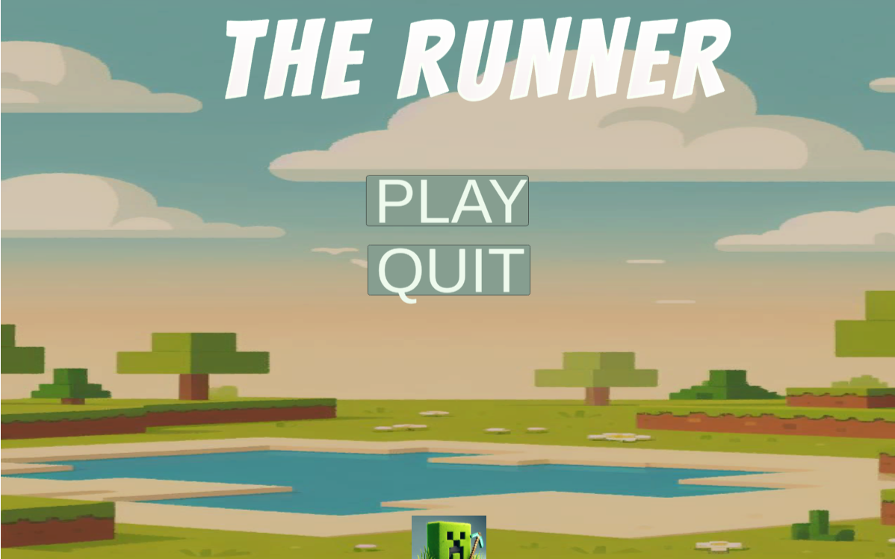

# Runner 🎯


## Basic Details
### Team Name: Trident


### Team Members
- Team Lead: Vishnu M - NSS College of Engineering , Palakkad
- Member 2: Advay P Kishore - NSS College of Engineering , Palakkad
- Member 3: Niyalurahman K K - NSS College of Engineering , Palakkad


### Project Description
  An endless runner game suitable in both desktop and smartphone to kill time and boredom made with unity game engine

### The Problem (that doesn't exist)
i am lazy

### The Solution (that nobody asked for)
an enhanced version of google's dino game

## Technical Details
### Technologies/Components Used
For Software:
- c#
- UI toolkit
- UNITY


## Implementation

### Software
This project is developed in Unity . The project structure includes assets for gameplay, scripts for logic, and prefabs for reusable game elements. Key implementations include:

- **Gameplay Mechanics**:Character movement,gravity,boxcollider etc.
- **UI/UX**: Mention HUD elements, menus, and any interactive UI.
- **Sound and Visuals**:used some bgm....
---

## Installation

Follow these commands to set up the project on your local machine.

1. Clone the repository:
   ```bash
   git clone git@github.com:Advay004/trident_useless_project.git


# Screenshots (Add at least 3)

*Loading screen*


*Game play*


*Game over screen*


### Project Demo
# Video
https://www.youtube.com/watch?v=rq2MTQCO2aw
*The gameplay of the game*

# Additional Demos
https://trident-useless-project-wxfz.vercel.app/ click to play the game suitable for both pc and mobile phones......

## Team Contributions
- Vishnu M: Front End
- Niyalurahman: Backend
- Advay: Game development

---
Made with ❤️ at TinkerHub Useless Projects 


